# Class Diagram — OOP AI Agent Framework

Sơ đồ lớp tổng thể của hệ thống, thể hiện đầy đủ 4 design pattern bắt buộc
(**Strategy** — Evaluator/LLMClient, **Template Method** — AgentLoop,
**Registry/Factory** — ToolRegistry, **Observer/Hook** — step_hook) cùng 2
pattern bổ sung (**Decorator** — PolicyEnforcedTool, **Builder** —
AgentLoopBuilder).

> File này dùng cú pháp [Mermaid](https://mermaid.js.org/) — hiển thị trực
> tiếp trên GitHub/GitLab, hoặc trong VS Code với extension "Markdown Preview
> Mermaid Support". Xem thêm `docs/README.md`.

```mermaid
classDiagram
    direction TB

    %% ===================== CLIENT LAYER (Strategy) =====================
    class LLMClient {
        <<abstract>>
        +chat(messages, options) expected~ChatResult, string~
        +embed(text) expected~vector~float~, string~
        +provider_name() string
    }
    class OllamaClient {
        -Config config_
        +chat(messages, options) expected~ChatResult, string~
        +health_check() bool
    }
    class MockLLMClient {
        -deque~ChatResult~ queue_
        -ResponderFn responder_
        +enqueue_tool_call(thought, tool, args)
        +enqueue_final_answer(thought, answer)
        +chat(messages, options) expected~ChatResult, string~
    }
    LLMClient <|-- OllamaClient
    LLMClient <|-- MockLLMClient

    %% ===================== TOOLS LAYER (Registry/Factory + Decorator) =====================
    class Tool {
        <<abstract>>
        +name() string
        +description() string
        +parameters_schema() string
        +execute(args_json, env) ToolResult
        +is_mutating() bool
    }
    class CalculatorTool
    class FileTool
    class ExecTool
    class DateTimeTool
    class MemoryTool {
        -sqlite3* db_
        -EmbeddingFn embedding_fn_
        +vector_search_enabled() bool
    }
    class PythonExecTool
    class HttpFetchTool
    class WebSearchTool
    class PolicyEnforcedTool {
        -unique_ptr~Tool~ inner_
        -ToolPolicy policy_
    }
    Tool <|.. CalculatorTool
    Tool <|.. FileTool
    Tool <|.. ExecTool
    Tool <|.. DateTimeTool
    Tool <|.. MemoryTool
    Tool <|.. PythonExecTool
    Tool <|.. HttpFetchTool
    Tool <|.. WebSearchTool
    Tool <|.. PolicyEnforcedTool
    PolicyEnforcedTool o-- Tool : bọc (decorate)

    class ToolRegistry {
        -unordered_map~string, unique_ptr~Tool~~ tools_
        -optional~ToolPolicy~ policy_
        +register_tool(tool)
        +register_factory(name, factory)
        +require(name) Tool&
        +render_tools_prompt() string
    }
    class ToolPolicy {
        <<enumeration Mode>>
        +is_allowed(name) bool
    }
    ToolRegistry o-- "many" Tool : sở hữu
    ToolRegistry ..> PolicyEnforcedTool : bọc khi có policy
    ToolRegistry --> ToolPolicy

    %% ===================== AGENT LAYER (Template Method) =====================
    class Environment {
        <<abstract>>
        +working_directory() path
        +resolve_path(raw) path
        +is_command_allowed(cmd) bool
        +setup()
        +teardown()
    }
    class NativeEnvironment
    class SandboxEnvironment {
        -vector~string~ denied_keywords_
    }
    Environment <|.. NativeEnvironment
    Environment <|.. SandboxEnvironment

    class LoopDetector {
        -deque~string~ history_
        +record_and_check(signature) LoopDetectionResult
    }
    class SkillLoader {
        -vector~Skill~ skills_
        +select_for_task(instruction) vector~Skill*~
        +render_injection_block(selected) string
    }

    class AgentLoop {
        #LLMClient llm_
        #ToolRegistry tools_
        #Environment env_
        -LoopDetector loop_detector_
        -SkillLoader* skill_loader_
        -StepHook step_hook_
        +run(task_id, instruction) Trajectory
        #think(history) expected~ChatResult, string~
        #act(action) ToolResult
        #observe(step)
    }
    class ConfirmingAgentLoop {
        #act(action) ToolResult
    }
    AgentLoop <|-- ConfirmingAgentLoop : override act()
    AgentLoop --> LLMClient : dùng qua interface
    AgentLoop --> ToolRegistry
    AgentLoop --> Environment
    AgentLoop --> LoopDetector
    AgentLoop --> SkillLoader

    class AgentLoopBuilder {
        -LLMClient* llm_
        -ToolRegistry* tools_
        +with_llm(llm) AgentLoopBuilder
        +with_tools(tools) AgentLoopBuilder
        +build() unique_ptr~AgentLoop~
    }
    AgentLoopBuilder ..> AgentLoop : dựng (Builder)

    %% ===================== HARNESS LAYER (Strategy + Observer) =====================
    class Evaluator {
        <<abstract>>
        +evaluate(trajectory, task) EvalResult
        +name() string
    }
    class KeywordEvaluator
    class FunctionalEvaluator
    class VLMEvaluator {
        -LLMClient judge_client_
    }
    Evaluator <|.. KeywordEvaluator
    Evaluator <|.. FunctionalEvaluator
    Evaluator <|.. VLMEvaluator
    VLMEvaluator --> LLMClient : dùng làm giám khảo

    class Trajectory {
        +string task_id
        +bool success
        +vector~Step~ steps
        +to_json() json
        +save_to_file(path)
    }
    class Task {
        +string id
        +string eval_type
        +optional~string~ eval_script
    }
    class HarnessRunner {
        -LLMClient llm_
        -ToolRegistry tools_
        +run_task(task) TaskRunResult
        +run_batch(tasks) BatchReport
        -make_evaluator(task) unique_ptr~Evaluator~
    }
    HarnessRunner ..> AgentLoop : tạo & chạy (KHÔNG kế thừa)
    HarnessRunner ..> SandboxEnvironment : setup môi trường
    HarnessRunner o-- Evaluator : chọn Strategy theo eval_type
    HarnessRunner ..> Trajectory
    HarnessRunner ..> Task

    %% ===================== MULTI-AGENT (bonus 10.3) =====================
    class SubAgentOrchestrator {
        -MessageQueue~AgentMessage~ message_queue_
        +run_parallel(sub_tasks) vector~SubAgentResult~
    }
    SubAgentOrchestrator ..> AgentLoop : spawn 1 instance / thread

    note for AgentLoop "TEMPLATE METHOD: run() là khung sườn CỐ ĐỊNH;\nthink()/act()/observe() là hook virtual protected.\nAgentLoop KHÔNG include harness_runner.h (mục 4.4)."
    note for HarnessRunner "step_hook (std::function) là kênh OBSERVER duy nhất\nHarnessRunner dùng để 'nghe' AgentLoop — không có\nquan hệ kế thừa hay include ngược lại."
    note for PolicyEnforcedTool "DECORATOR: bọc Tool gốc,\nchặn execute() nếu ToolPolicy từ chối,\nnếu không thì uỷ quyền trong suốt."
```

## Ghi chú về notation UML dùng trong sơ đồ

| Ký hiệu Mermaid | Ý nghĩa UML |
| --- | --- |
| `<|--` | Kế thừa (inheritance/generalization) |
| `<|..` | Hiện thực hoá interface trừu tượng (realization) |
| `o--` | Aggregation (sở hữu nhưng vòng đời độc lập) |
| `*--` | Composition (vòng đời gắn liền) |
| `..>` | Dependency (chỉ dùng tạm thời / tạo ra) |
| `-->` | Association (tham chiếu lâu dài, thường qua reference/pointer) |

## Đối chiếu với 4 Design Pattern bắt buộc

1. **Strategy** — `Evaluator` (KeywordEvaluator/FunctionalEvaluator/VLMEvaluator) và
   `LLMClient` (OllamaClient/MockLLMClient) đều là interface trừu tượng có nhiều
   triển khai hoán đổi được tại runtime.
2. **Template Method** — `AgentLoop::run()` định nghĩa khung ReAct cố định;
   `think()/act()/observe()` là các bước con virtual protected mà
   `ConfirmingAgentLoop` override để minh hoạ.
3. **Registry + Factory** — `ToolRegistry` (và `util::Registry<T>` tổng quát bên
   dưới) quản lý việc đăng ký/tạo `Tool` theo tên.
4. **Observer/Hook** — `AgentLoop::step_hook_` (kiểu `std::function<void(const Step&)>`)
   cho phép `HarnessRunner` "lắng nghe" từng bước mà `AgentLoop` không hề biết
   sự tồn tại của `HarnessRunner` (đúng yêu cầu tách lớp mục 4.4).

Pattern bổ sung (không bắt buộc, làm thêm để hiểu sâu hơn):

5. **Decorator** — `PolicyEnforcedTool` bọc một `Tool` bất kỳ để áp `ToolPolicy`
   một cách trong suốt.
6. **Builder** — `AgentLoopBuilder` dựng `AgentLoop` qua chuỗi gọi hàm fluent,
   dùng kỹ thuật C++23 "deducing this" (`this auto&& self`).
