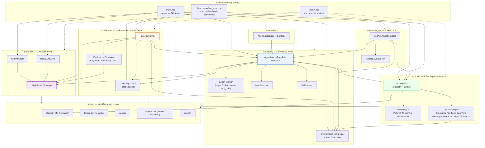

# Component Diagram — Kiến trúc phân lớp tổng thể

Sơ đồ thể hiện các "module" (thư mục `src/*`) và **hướng phụ thuộc cho phép**
giữa chúng (mục 4.4 đề bài: "Agent Loop KHÔNG include harness_runner.h",
"Tool KHÔNG include agent_loop.h", v.v.). Mũi tên chỉ từ module PHỤ THUỘC
sang module ĐƯỢC PHỤ THUỘC.

## Ràng buộc kiến trúc quan trọng (đã kiểm chứng bằng cách đọc `#include`)

| Ràng buộc | Trạng thái |
| --- | --- |
| `src/agent/*` KHÔNG include `src/harness/harness_runner.h` | ✅ Đúng — `AgentLoop` chỉ expose `step_hook_` chung chung |
| `src/tools/*` KHÔNG include `src/agent/agent_loop.h` | ✅ Đúng — `Tool::execute()` chỉ nhận `Environment&`, không biết AgentLoop |
| `src/client/*` KHÔNG include bất kỳ gì ở tầng trên | ✅ Đúng — `LLMClient` là tầng thấp nhất, độc lập hoàn toàn |
| `HarnessRunner` là nơi DUY NHẤT nối `AgentLoop` + `Evaluator` | ✅ Đúng — cả hai chỉ "gặp nhau" bên trong `run_task()` |

Việc tách lớp nghiêm ngặt này là điều kiện để `MockLLMClient` có thể thay thế
`OllamaClient` trong toàn bộ test suite (`tests/*.cpp`) mà không cần sửa một
dòng nào ở các tầng `agent/`, `tools/`, `harness/` — minh chứng thực nghiệm
rằng ranh giới trừu tượng hoá thực sự hoạt động, không chỉ nằm trên giấy.
