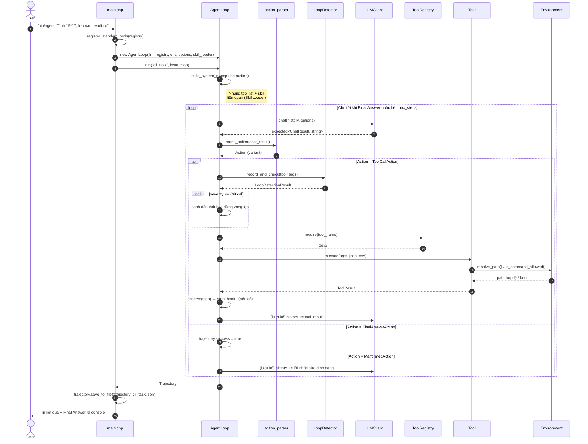

# Sequence Diagram — Một lượt chạy Agent (CLI)

Minh hoạ luồng `./bin/agent "Tính 15 nhân 17 rồi lưu vào result.txt"` — từ lúc
người dùng gõ lệnh tới khi nhận được Trajectory hoàn chỉnh. Đây là ví dụ với
**đúng 1 tool call rồi Final Answer**; vòng lặp `Think → Act → Observe` có thể
lặp lại nhiều lượt tuỳ nhiệm vụ (xem khung `loop` bên dưới).

## Điểm nhấn thiết kế thể hiện trong sơ đồ

- **Template Method**: khung `loop` (Think → parse → Act/Observe) nằm trọn
  trong `AgentLoop::run()` — không lớp nào bên ngoài (CLI, Harness) can thiệp
  vào trình tự này.
- **Strategy**: `LLM` có thể là `OllamaClient` hoặc `MockLLMClient` — sơ đồ
  không đổi dù đổi implementation.
- **Observer/Hook**: bước `observe(step)` là điểm duy nhất AgentLoop "phát tín
  hiệu" ra ngoài qua `step_hook_`, không biết ai đang lắng nghe.
- Tách lớp rõ ràng: `AgentLoop` không hề gọi tới `HarnessRunner` — nó chỉ biết
  `LLMClient`, `ToolRegistry`, `Environment`, `SkillLoader`.
