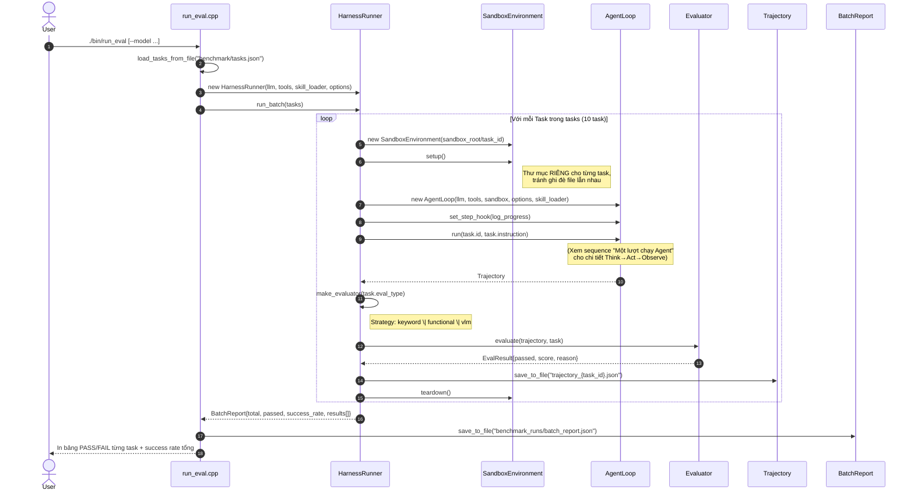

# Sequence Diagram — Harness chạy Batch Benchmark

Minh hoạ luồng `./bin/run_eval` xử lý toàn bộ `benchmark/tasks.json`: với MỖI
task, `HarnessRunner` tự thực hiện đúng chu trình **setup environment → run
agent → evaluate → record** (mục 3.6 đề bài), lặp lại cho 10 task rồi tổng hợp
`BatchReport`.

## Điểm nhấn thiết kế thể hiện trong sơ đồ

- **Separation of concerns (mục 4.4)**: `HarnessRunner` là bên **duy nhất**
  biết cách tạo `AgentLoop` VÀ `Evaluator` cùng lúc — bản thân `AgentLoop`
  không có logic gì liên quan tới việc chấm điểm hay batch.
- **Strategy pattern**: `make_evaluator()` chọn đúng 1 trong 3 Evaluator dựa
  trên `Task::eval_type`, tất cả dùng chung interface `evaluate()`.
- **Cô lập tài nguyên**: mỗi task có `SandboxEnvironment` riêng (setup/teardown
  quanh vòng đời của nó), trong khi `ToolRegistry` (kể cả `MemoryTool` có
  trạng thái SQLite) được chia sẻ xuyên suốt batch — mô phỏng đúng ngữ cảnh
  "bộ nhớ dài hạn qua nhiều lượt chạy" của bonus mục 10.2.
